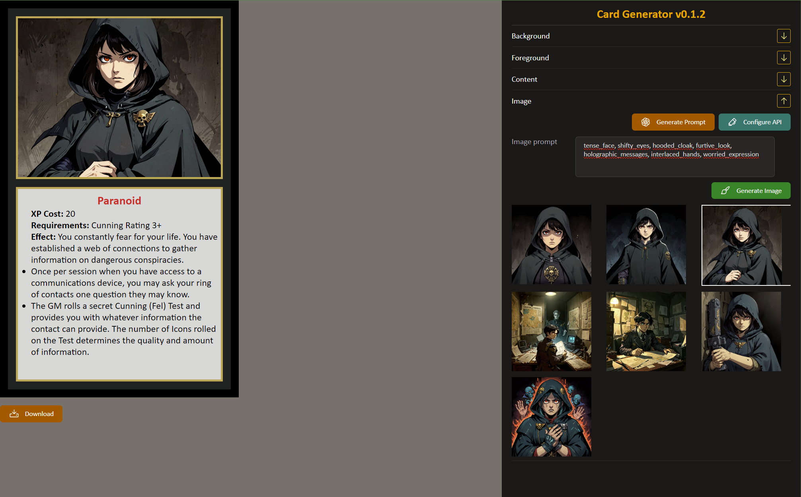

# 🎴 Card-Gen
Small npm project that allows you to create cards for tabletop games using AI.
You provide card description and AI handles formatting and image generation.

## How to use
1) (optional) You will need an [OpenAI API key](https://platform.openai.com/docs/api-reference/introduction). Card-gen uses a gpt4.5o to format your description to markdown and to generate Stable Diffusion prompt. If you dont want to use chatGPT, skip this step
2) Setup Stable Diffusion with a ComfyUI locally or in the cloud
3) Setup a pipeline for image generation
4) Run the project locally `npm install && npm run start`
5) Setup urls and api keys in the "Configure API" menu
6) Enjoy
