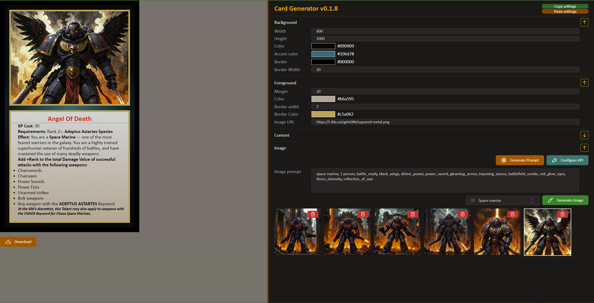

# 🎴 Card-Gen
Small npm project that allows you to create cards for tabletop games using AI.
You provide card description and AI handles formatting and image generation.

## How to use
1) (optional) You will need an [OpenAI API key](https://platform.openai.com/docs/api-reference/introduction). Card-gen uses a gpt4.5o to format your description to markdown and to generate Stable Diffusion prompt. If you dont want to use chatGPT, skip this step
2) Setup Stable Diffusion with a ComfyUI locally or in the cloud
3) Setup a pipeline for image generation
4) Run the project locally `npm install && npm run start` (or use [Github Pages version](https://everlasting17th.github.io/card_gen/))
5) Setup urls and api keys in the "Configure API" menu
6) Enjoy

#### What should I do with the prompts ?
1) **Image prompt**. Describe art style, shading, amount of details and basically everything what should stay the same between images. Insert `{0}` in your prompt. During generation, card illustration prompt will be inserted here.
2) **Negative prompt**. Anything you dont want in your images, search for basic negative prompts if not sure how to start.
3) *(optional)* **Open AI prompt**. This prompt will only be used if you set up Open Ai API key in the settings. You have to describe a task of distilling text description into SD tags to Chat GPT. For examples look into examples/folder. End your prompt with `{0}`

## Usage of Comfy UI Pipeline
1) Enable dev mode in the Comfy UI settings
2) Click Save (API Format) to download pipeline JSON file
3) In the JSON file find your promt, negative promt and random seed. Replace values with `!positive_prompt!`, `!negative_prompt!` and `!random_seed!` accordingly
4) Now paste resulting JSON into the Comfy Pipeline field

### Plans / TODO's
1) Configurable LORAs (Integration with Power LORA Node?)
2) Batching
